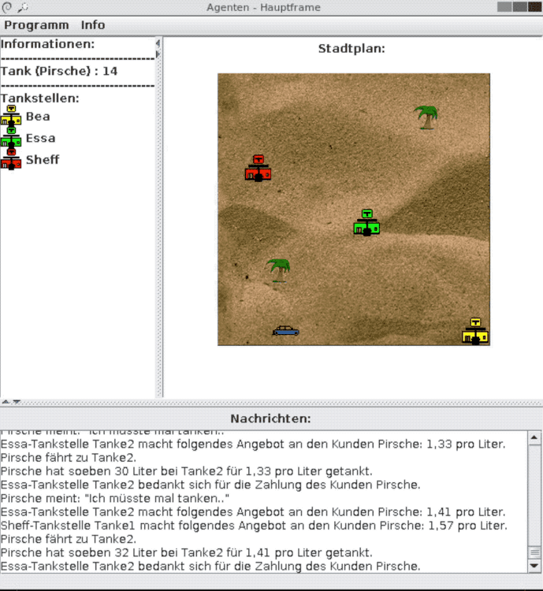

# JADE Multi-Agent System - Petrol Station Simulation

## Overview

A multi-agent system simulation built with JADE (Java Agent DEvelopment Framework) that models interactions between autonomous car agents and petrol stations. Originally developed in 2004-2005, this project demonstrates agent-based modeling with real-time visualization.



## Quick Start

### Prerequisites
- **Java**: JDK 8+ (recommended: OpenJDK 11, 17, or 21)
- **Display**: GUI requires X11 (Linux/macOS) or Windows display

### Build and Run
```bash
# Using included Gradle wrapper (recommended)
./gradlew build
./gradlew run

# Or with system Gradle
gradle build
gradle run
```

### Expected Output
- JADE platform initialization messages
- Agent creation confirmations (in German)
- GUI window with simulation map showing cars and petrol stations

## Project Structure

- **`agents/`**: Car and PetrolStation agent implementations
- **`behaviours/`**: Agent behavior definitions (searching, driving, fueling)
- **`gui/`**: Swing-based graphical interface
- **`libs/jade.jar`**: JADE 4.6.0 framework (included)

## Build System

Modern Gradle build system with:
- **Automated Dependencies**: JADE classpath handled automatically
- **Cross-Platform**: Works on Linux, macOS, Windows
- **IDE Integration**: IntelliJ IDEA, Eclipse, VS Code support

### Additional Commands
```bash
# Create executable JAR
./gradlew jar
java -cp "libs/jade.jar:build/libs/project-1.0.0.jar" main.Main

# Clean build
./gradlew clean build

# Headless mode (servers)
./gradlew run -Djava.awt.headless=true
```

## macOS Setup

### Installation
```bash
# Install Java via Homebrew
brew install openjdk@11

# Add to PATH (add to ~/.zshrc)
export PATH="/opt/homebrew/opt/openjdk@11/bin:$PATH"
```

### Security Permissions
If blocked by macOS security:
1. Go to **System Preferences > Security & Privacy > Privacy > Accessibility**
2. Add Java or Terminal to allowed applications
3. Or temporarily: `sudo spctl --master-disable` (remember to re-enable)

## Troubleshooting

### Build Issues
```bash
# Check versions
java -version
./gradlew --version

# Clean rebuild
./gradlew clean build
```

### Runtime Issues
```bash
# Check JADE platform
./gradlew run --info

# Linux: X11 display issues
echo $DISPLAY
sudo apt-get install xorg

# Virtual display (headless Linux)
Xvfb :1 -screen 0 1024x768x24 &
export DISPLAY=:1
./gradlew run
```

### Memory Issues
Add to `build.gradle`:
```gradle
run {
    jvmArgs = ['-Xmx2g', '-Xms512m']
}
```

### JAR Execution
```bash
# Verify JAR contents
jar -tf build/libs/project-1.0.0.jar | head -10

# Debug classpath
java -cp "libs/jade.jar:build/libs/project-1.0.0.jar" -verbose:class main.Main
```

## Development Notes

- **Framework**: JADE 4.6.0 for multi-agent systems
- **Communication**: ACL (Agent Communication Language)
- **GUI**: Java Swing with real-time agent visualization
- **Historical**: Early 2000s agent-based modeling example

## License

Academic coursework project. Respect institutional guidelines for code sharing.